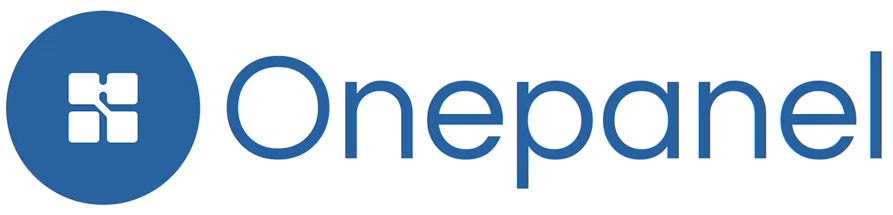
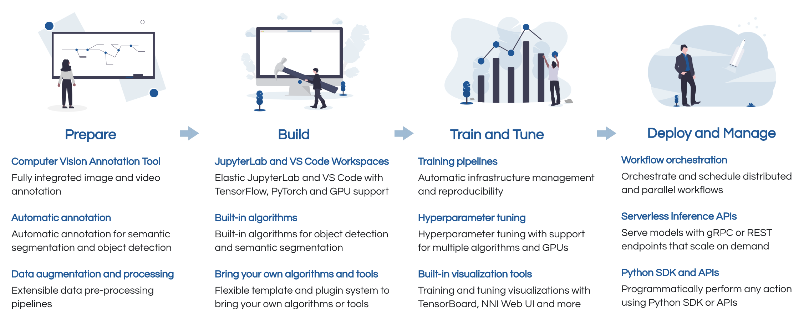

The open and extensible integrated development environment (IDE) for computer vision with built-in modules for model building, automated labeling, data processing, model training, hyperparameter tuning and workflow orchestration.

## Why Onepanel?

## Quick start
See [quick start guide](https://docs.onepanel.ai/docs/getting-started/quickstart) to get started.

## Online demo
For a quick look at some features see this shared, read-only [online demo](https://onepanel.typeform.com/to/kQfDX5Vf?product=github).

## Community
To submit a feature request, report a bug or documentation issue, please open a GitHub [pull request](https://github.com/onepanelio/core/pulls) or [issue](https://github.com/onepanelio/core/issues).

For help, questions, release announcements and contribution discussions, join us on [Slack](https://join.slack.com/t/onepanel-ce/shared_invite/zt-eyjnwec0-nLaHhjif9Y~gA05KuX6AUg).

## Contributing
Onepanel is modular and consists of [multiple repositories](https://docs.onepanel.ai/docs/getting-started/contributing/#project-repositories).

See [contribution guide](https://docs.onepanel.ai/docs/getting-started/contributing) and `CONTRIBUTING.md` in each repository for additional contribution guidelines.

## Acknowledgments
Onepanel seamlessly integrates the following open source projects under the hood:

[Argo](https://github.com/argoproj/argo) | [Couler](https://github.com/couler-proj/couler) | [CVAT](https://github.com/opencv/cvat) | [JupyterLab](https://github.com/jupyterlab/jupyterlab) | [NNI](https://github.com/microsoft/nni)

We are grateful for the support these communities provide and do our best to contribute back as much as possible.

## License
Onepanel is licensed under [Apache 2.0](https://github.com/onepanelio/core/blob/master/LICENSE).

## For organizations
Visit our [website](https://www.onepanel.ai/) for more information on support options and enterprise solution.
