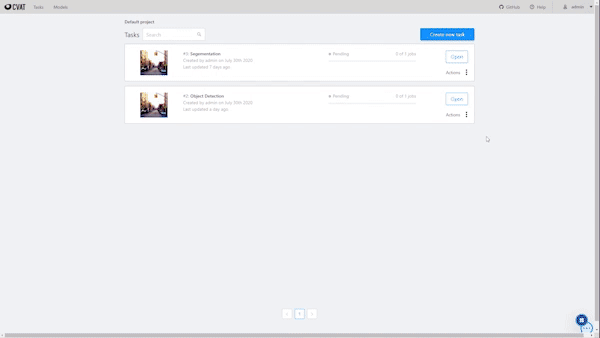

Full stack vision AI platform with fully integrated modules for model building, semi-automated labeling, training and data pipelines, powered by Kubernetes.

## Features
| | | |
|:-------------------------:|:-------------------------:|:-------------------------:|
| <h4>Image and video annotation with automatic pre-annotation</h4> | <h4>GPU optimized JupyterLab with Tensorflow and PyTorch</h4>| <h4>Highly scalable training pipelines with streaming logs</h4>|
||||

## Quick start
See [Quick start guide](https://docs.onepanel.ai/docs/getting-started/quickstart) to get started with the platform of your choice.

## Community

## Contributing

This is the main repository for the API. It is also where you can submit bugs and enhancement requests.

See our [Contribution guide](https://docs.onepanel.ai/docs/getting-started/contributing) to get started.

## Acknowledgments
We use these excellent open source projects to power different areas of Onepanel:

[Argo](https://github.com/argoproj/argo)\
[CVAT](https://github.com/opencv/cvat)\
[JupyterLab](https://github.com/jupyterlab/jupyterlab)
