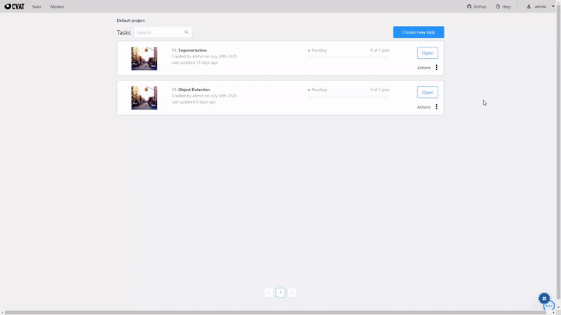
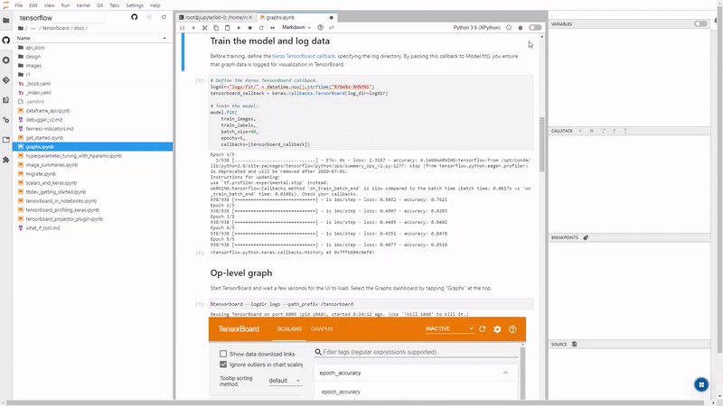
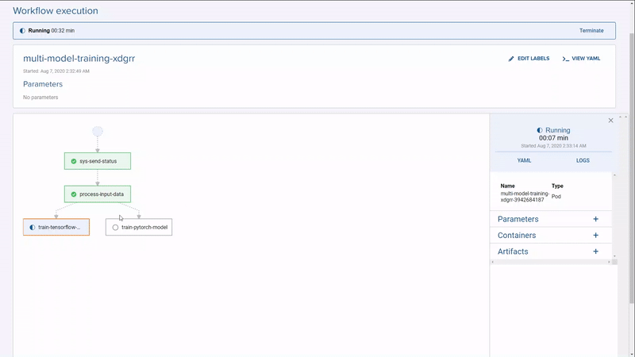
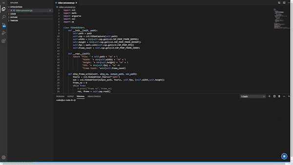

Production scale, Kubernetes-native vision AI platform, with fully integrated components for model building, automated labeling, data processing and model training pipelines.

## Why Onepanel?

-  End-to-end workflow and infrastructure automation for production scale vision AI
-  Automatic resource management and on-demand scaling of CPU and GPU nodes
-  Easily scale your data processing and training pipelines to multiple nodes
-  Collaborate on all your deep learning tools and workflows through a unified web interface and SDKs
-  Scalability, flexibility and resiliency of Kubernetes without the deployment and configuration complexities

## Features
<table>
  <tr>
    <td width="50%" align="center">
      <h3>Image and video annotation with automatic annotation</h3>
      
      

        Annotate images and video with automatic annotation of bounding boxes and polygon masks, integrated with training pipelines to iteratively improve models for pre-annotation and inference
      

    </td>
    <td width="50%" align="center">
      <h3>JupyterLab with TensorFlow, PyTorch and GPU support</h3>
      
      

        JupyterLab configured with extensions for debugging, Git/GitHub, notebook diffing and TensorBoard and support for Conda, OpenCV, Tensorflow and PyTorch with GPU and <a href="https://github.com/onepanelio/templates/tree/master/workspaces/jupyterlab">much more</a>
      

    </td>
  </tr>
  <tr>
    <td width="50%" align="center">
      <h3>Auto scaling, distributed and parallel data processing and training pipelines</h3>
      
      

        Build fully reproducible, distributed and parallel data processing and training pipelines with real-time logs and output snapshots
      

    </td>
    <td width="50%" align="center">
      <h3>Version controlled pipelines and environments as code</h3>
      
      

        Bring your own IDEs, annotation tools and pipelines with a version controlled YAML and Docker based template engine
      

    </td>
  </tr>
</table>

-  Track and visualize model metrics and experiments with TensorBoard or bring your own experiment tracking tools.
-  Access and share tools like AirSim, Carla, Gazebo or OpenAI Gym through your browser with VNC enabled workspaces.
-  Extend Onepanel with powerful REST APIs and SDKs to further automate your pipelines and environments.
-  Workflows, environments and infrastructure are all defined as code and version controlled, making them reproducible and portable.
-  Powered by Kubernetes so you can deploy anywhere Kubernetes can run.

## Quick start
See [quick start guide](https://docs.onepanel.ai/docs/getting-started/quickstart) to get started with the platform of your choice.

### Quick start videos
[Getting started with Amazon EKS](https://youtu.be/Ipdd8f6D6IM)

## Community
See [documentation](https://docs.onepanel.ai) to get started or for more detailed operational and user guides.

To submit a feature request, report a bug or documentation issue, please open a GitHub [pull request](https://github.com/onepanelio/core/pulls) or [issue](https://github.com/onepanelio/core/issues).

For help, questions, release announcements and contribution discussions, join us on [Slack](https://join.slack.com/t/onepanel-ce/shared_invite/zt-eyjnwec0-nLaHhjif9Y~gA05KuX6AUg).

## Contributing

Onepanel is modular and consists of the following repositories:

[Core API](https://github.com/onepanelio/core/) (this repository) - Code base for backend (Go)\
[Core UI](https://github.com/onepanelio/core-ui/) - Code base for UI (Angular + TypeScript)\
[CLI](https://github.com/onepanelio/cli/) - Code base for Go CLI for installation and management (Go)\
[Manifests](https://github.com/onepanelio/core-ui/) - Kustomize manifests used by CLI for installation and management (YAML)\
[Python SDK](https://github.com/onepanelio/python-sdk/) - Python SDK code and documentation\
[Templates](https://github.com/onepanelio/templates) - Various Workspace, Workflow, Task and Sidecar Templates\
[Documentation](https://github.com/onepanelio/core-docs/) - The repository for documentation site\
[API Documentation](https://github.com/onepanelio/core-api-docs/) - API documentation if you choose to use the API directly

See `CONTRIBUTING.md` in each repository for development guidelines. Also, see [contribution guide](https://docs.onepanel.ai/docs/getting-started/contributing) for additional guidelines.

## FAQ

REMOVE NOTES:  Need to format the Q&A section somehow, maybe indent the A:?

Q: How is Onepanel different from using Google Colab?

A: Colab is great for small scale experiments but not geared for production. Onepanel's goal is to provide an end-to-end platform for building, training, and deploying computer vision projects into production. Out of the box, you can use TensorFlow or PyTorch along with JupyterLab as your main IDE/notebook. You can also create templates for your own frameworks/IDEs, for example, here is a simple one for VS Code.

In a typical production project, you have an annotation team that works on labeling data, a data science team that will build/train models based on the labeled data, and a data/ML engineering team that will build the data processing, continuous training pipelines so you can iteratively improve your data and models. In smaller teams, this may be a couple of people wearing multiple hats.

With Onepanel, you get the infrastructure and tools to make this end-to-end workflow possible. With Colab, you really only get the model building and training aspect of this workflow. The other issue with Colab is that it runs on a single machine. If you are training on real-world data, you'd probably want to train your models in parallel, use different hyperparameters and run the training on different machines to expedite your training. This requires a system like Onepanel to automatically scale up these machines, run the training scripts, aggregate and snapshot metrics and output data (models, logs, etc.) and then scale down the machines when training is complete.

Q: Why deploy Onepanel on-premises vs. using a PaaS?

A: Most InfoSec and Compliance departments at larger enterprises will require strict requirements for data security and privacy.  A good example is the EU's https://gdpr.eu/what-is-gdpr/).  Onepanel can be deployed on-premises where all security and privacy controls can be rigorously maintained.

Q: What hardware is needed to run Onepanel CE 

A: INSERT REQUIREMENTS HERE FOR A.) DESKTOP B:) Minimum cloud requirements C.) Link back to the docs section

Q: Why make it a computer vision platform instead of a more general-purpose tool? 

A: Nothing stops you from using Onepanel for other types of ML tasks. In fact, right now, you can use all the features other than the image/video labeling tool for let's say NLP. You can even create your own template for a text annotation tool like doccano and plug that into your workflow.

Our goal is to initially focus on computer vision and provide exceptional tooling and user experience, but at the same time make the platform flexible so that we can extend to additional subfields and provide the best UX and tooling for those subfields.

Q: What's the difference between using Onepanel CE and AWS Sagemaker?

A: Onepanel can be deployed on any cloud provider or on-premise.  Onepanel abstracts many of the time consuming and complex infrastructure needed to deploy a seamless end-to-end computer vision pipeline.

Q: Can I create my own Workspace modules from my own Docker image and integrate it into Onepanel?

A: Yes, Onepanel was fundamentally designed to be fully modular and extensible.  You can create or customize existing templates using YAML to fully integrate any tools required for your computer vision pipeline

## Acknowledgments
Onepanel seamlessly integrates the following excellent open source projects. We are grateful for the support these communities provide and do our best to contribute back as much as possible.

[Argo](https://github.com/argoproj/argo)\
[CVAT](https://github.com/opencv/cvat)\
[JupyterLab](https://github.com/jupyterlab/jupyterlab)

## License
Onepanel is licensed under [Apache 2.0](https://github.com/onepanelio/core/blob/master/LICENSE).

## Need a managed solution?
Visit our [website](https://www.onepanel.io/) for more information about our managed offerings.
