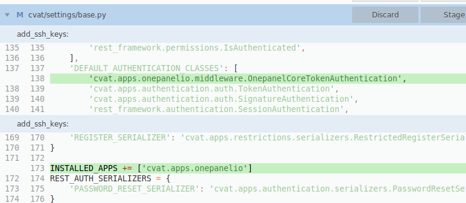
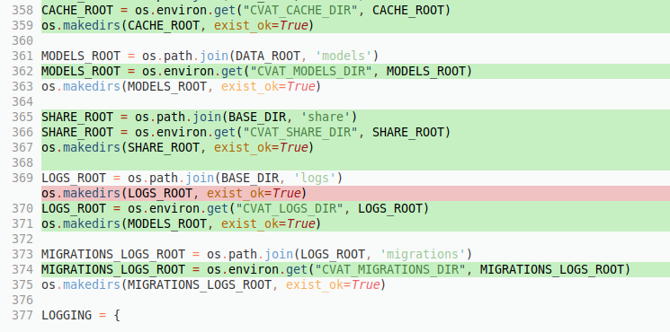

# Assume all file paths are from project root.

# `Dockerfile`
Usually, we add vim and nano to the build for ease of debugging remotely (and inside
the CLI).

- Not required

# `.gitignore`
If you're using JetBrains IDE products, this will keep out their IDE folder.

# `cvat/requirements/base.txt`
Add onepanel-sdk and google-cloud-storage.
- SDK for our authentication and creating workflows on onepanel, from inside CVAT.
- Google Cloud Storage because we support uploading to GCS.
    - Storing annotations, etc
    

# Copy everything over `cvat/apps/onepanelio`

# Add relevant onepanel URLs to `cvat/urls.py`

# Update `cvat/settings/base.py` to enable onepanel related pieces.

# As of right now, we need to enable environment variables for CVAT as well.
`cvat/settings/base.py`

